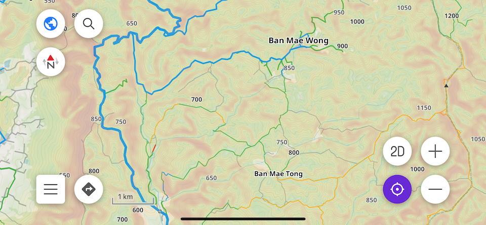

> **Important**: This plugin is currently under active development. If you encounter any issues or have suggestions for improvements, please contact the developer using the information provided below.

# OsmAnd Dirtbike Plugin

This OsmAnd plugin includes a lightweight map style that highlights road and trail conditions for off-road motorcycles.

### Key Features

- **Color-coded Roads and Paths**: Easily distinguish roads and paths based on their physical or access conditions.
- **Consistent Road Representation**: Roads and pathways are displayed as straight lines (no dashes), with widths based on their classification.
- **Obstacles Marked**: Dead-ends are indicated by black dots, and barriers by red dots.

## Setup

### OsmAnd Installation

1. Install the [OsmAnd](https://play.google.com/store/apps/details?id=net.osmand) application on your device.
2. Open the application and tap on "Get started".
3. Download the Recommended Country dataset (if not already installed).

### First-time Plugin Installation

1. From your mobile browser, download the plugin [here](https://github.com/cmoffroad/osmand-dirtbike-plugin/raw/master/dist/osmand-dirtbike-plugin.osf).
2. Once the download is complete, click on "Open".
3. OsmAnd will automatically open and confirm the successful addition of the plugin.
4. Wait a few seconds for Suggested maps to appear (standard, contour lines).
5. Download the suggested datasets for your country (if not already installed).
6. Select "OK".
7. Tap the current profile icon on the top left corner.
8. Scroll down to "Map Style" and select "Dirtbike".

> **Note**: If you encounter a "Permission Denied" error on your Android phone:
> 1. Open your phone's Settings application.
> 2. Go to Apps > OsmAnd > Permissions.
> 3. Enable Storage and try reinstalling the plugin.

### Updating the Plugin

1. From your mobile browser, download the latest plugin version [here](./dist/osmand-dirtbike-plugin.osf).
2. Once the download is complete, click on "Open".
3. OsmAnd will automatically open and confirm the successful update of the plugin.
4. Close and re-open the application to ensure the renderer is updated.

### OsmAnd Subscriptions

In the free version of OsmAnd:
- Elevation data (Contour lines and Terrain) is not shown.
- OSM country datasets are updated once a month.

For enhanced outdoor exploration, consider a one-time or yearly subscription to enable:
- Elevation data.
- Hourly OSM dataset updates.

> **Note**: I am not affiliated with OsmAnd and do not receive any revenue from this plugin. After extensive research and experimentation, OsmAnd proved to be the best platform for creating my own maps.

> The OsmAnd Live feature is extremely useful for preparing maps before a trip. For example, you can add missing tracks via satellite imagery to OpenStreetMap. Your changes will appear in the OsmAnd application within an hour.

## Documentation

### Road and trail conditions

<table>
  <thead>
    <tr>
      <th>Default style</th>
      <th>Detailed colors</th>
      <th>Category</th>
      <th>OpenStreetMap tags</th>
  </thead>
  <tbody>
    <tr>
      <td></td>
      <td></td>
      <td>Excellent paved road</td>
      <td><code>smoothness=excellent OR surface=asphalt</code></td>
    </tr>
    <tr>
      <td></td>
      <td></td>
      <td>Other paved road</td>
      <td><code>smoothness=good OR tracktype=grade1 OR surface IN (paved, concrete, concrete:plates, concrete:lanes, paving_stones, sett, unhewn_cobblestone, metal)</code></td>
    </tr>
    <tr>
      <td></td>
      <td></td>
      <td>Well-maintained gravel or compacted roads</td>
      <td><code>dirtbike:scale=0 OR smoothness IN (good, intermediate, bad)</code></td>
    </tr>
    <tr>
      <td></td>
      <td></td>
      <td>Ungraded tracks with navigable small obstacles</td>
      <td><code>dirtbike:scale=1 OR smoothness=very_bad</code></td>
    </tr>
    <tr>
      <td></td>
      <td></td>
      <td>Rough tracks with moderate obstacles and slopes</td>
      <td><code>dirtbike:scale=2 OR smoothness=horrible</code></td>
    </tr>
    <tr>
      <td></td>
      <td></td>
      <td>Challenging trails with large obstacles and steep slopes</td>
      <td><code>dirtbike:scale=3 OR smoothness=very_horrible</code></td>
    </tr>
    <tr>
      <td></td>
      <td></td>
      <td>Hard Enduro trails with rugged terrain</td>
      <td><code>dirtbike:scale=4</code></td>
    </tr>
    <tr>
      <td></td>
      <td></td>
      <td>Extreme Enduro trails with unforgiving terrain</td>
      <td><code>dirtbike:scale=5</code></td>
    </tr>
    <tr>
      <td></td>
      <td></td>
      <td>Unclassified trails</td>
      <td><code>dirtbike:scale=? OR motorcycle=yes OR tracktype OR mtb:scale </code></td>
    </tr>
    <tr>
      <td></td>
      <td></td>
      <td>Unknown trails</td>
      <td></td>
    </tr>
  </tbody>
</table>

### Road types

<table>
  <thead>
    <tr>
      <th>Default style</th>
      <th>Restricted style</th>
      <th>Category</th>
      <th>OpenStreetMap tags</th>
    </tr>
  </thead>
  <tbody>
    <tr>
      <td></td>
      <td></td>
      <td>Major roads</td>
      <td>
        <code>highway IN (motorway, motorway_link, trunk, trunk_link, primary, primary_link, secondary, secondary_link)</code>
      </td>
    </tr>
    <tr>
      <td></td>
      <td></td>
      <td>Medium roads</td>
      <td><code>highway IN (tertiary, tertiary_link, unclassified)</code></td>
    </tr>
    <tr>
      <td></td>
      <td></td>
      <td>Minor roads</td>
      <td><code>highway IN (residential, service, track, construction, living_street, busway, pedestrian, escape, raceway)</code></td>
    </tr>
    <tr>
      <td></td>
      <td></td>
      <td>Paths</td>
      <td><code>highway IN (path, footway, cycleway, bridleway, steps)</code></td>
    </tr>
  </tbody>
</table>

  Restricted style conditions:
    
    highway IN (
      motorway, motorway_link, 
      construction, living_street, busway, pedestrian, escape, raceway, 
      footway, cycleway, bridleway, steps
      )
    OR access IN (no, private)
    OR motor_vehicle IN (no, private)
    OR motorcycle IN (no, private)

## Questions and Support

For questions, bug reports, or improvement requests, please contact me via:
- [Telegram](https://t.me/julcnx)
- [Facebook](https://www.facebook.com/julcnx)
- [OpenStreetMap](https://www.openstreetmap.org/message/new/julcnx)
